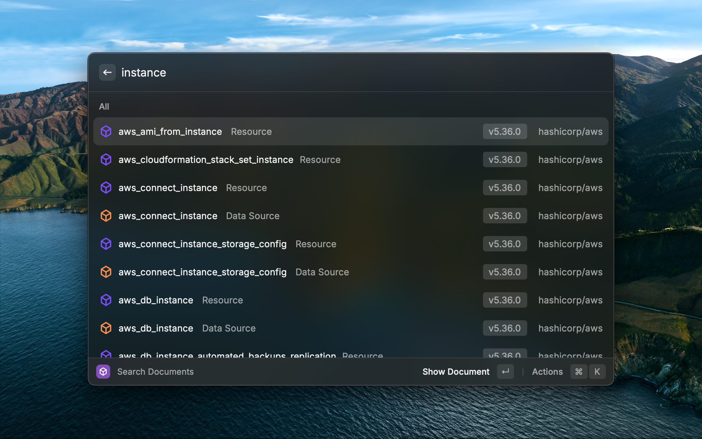

raycast-extensions
===

This repository contains a collection of extensions for the [Raycast](https://raycast.com) app.

These extensions are not provided with Raycast Store, but can be installed by cloning this repository and importing the extensions to your Raycast app.

## Terraform Provider Documents

This extension allows you to search for Terraform provider documentation using the [Terraform Registry](https://registry.terraform.io).

